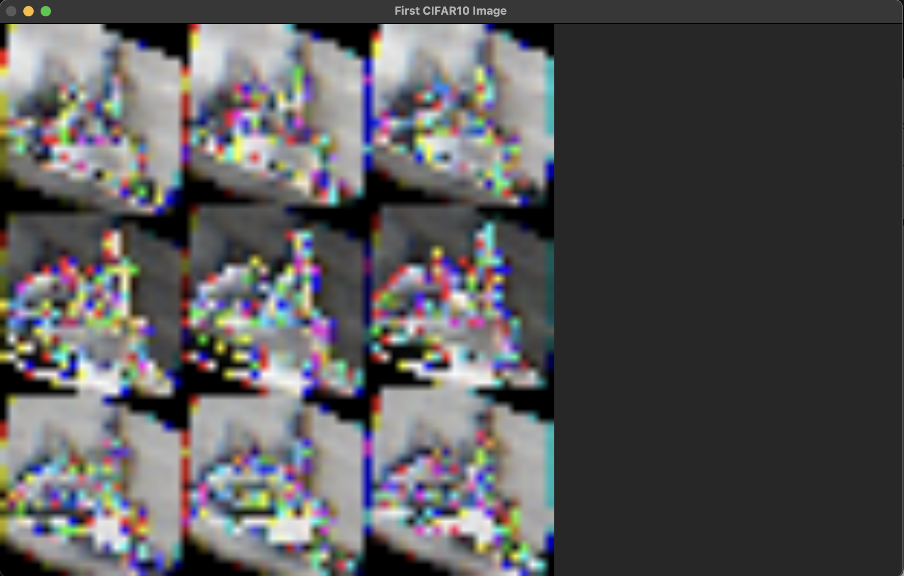
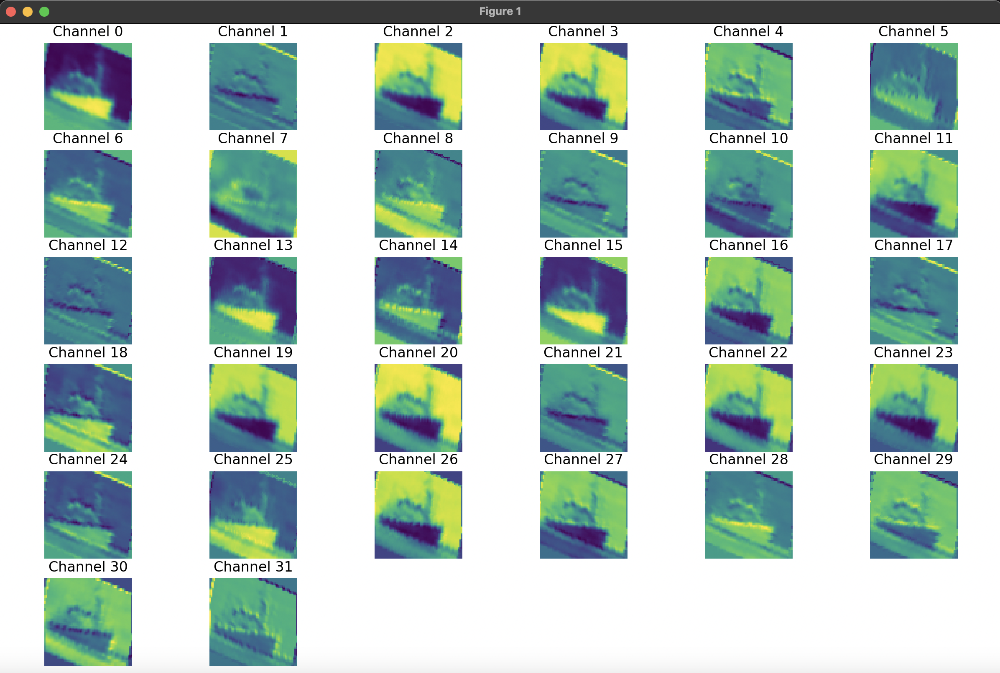

Already obtaining some fascinating results from the 3rd epoch trained CNN
on the CIFAR10 dataset.

Original, randomly sampled CIFAR10 image, after applying various transforms:

Some kind of cat, rotated??

All channels of the CIFAR10 image, after the first convolutional block:

A bunch of green cats